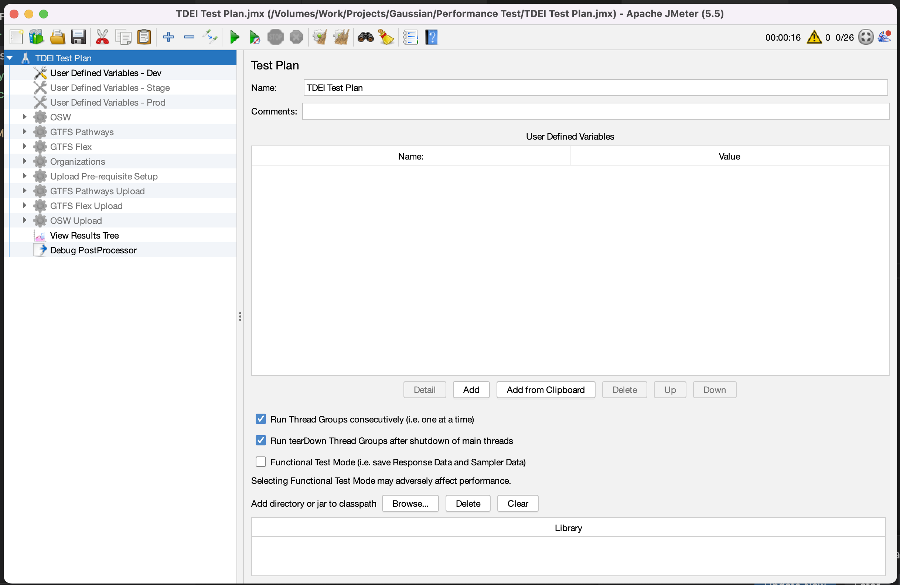

# TDEI-performance-tools
TDEI performance test tool suits


## JMeter

### Folder Details

- **assets** : Contains the assets associated with this repository
- **binary** : Pre-downloaded Apache Jmeter performace testing tool (5.5) with required plugins configuration
- **data** : Data files required for test execution
- **config** : TDEI configuration for Gateway API's

### Setup

1. Extract the `apache-jmeter-5.5.zip` file from the JMeter/Binary directory.

2. Using the terminal, navigate to the extracted directory and proceed to the "bin" folder. Run the following command:

```bash
sh jmeter
```

3. Running the above command will launch the JMeter graphical interface, providing an interactive configuration experience. It should resemble the image shown below.



### Setup the JMeter user defined variables

1. Under `TDEI Test Plan` root, click on the `User Defined Variables - {env}` specific to environment to run the performance test. 

2. Fill the below user defined variables 

| Variable | Description | 
|--|--|
|adminUserName | admin username of TDEI portal |
|adminUserPwd | admin username password |
| usermanagementhost| user management host url |
| defaultPassword| default passowrd for new test users |
| gatewayhost| api gateway host url|
| oswUploadFilePath| absolute path to the osw upload file |
| flexUploadFilePath| absolute path to the flex upload file|
| pathwaysUploadFilePath| absolute path to the pathways upload file|
| apiKey| TDEI API key for GET access |


### Enable environment 

- The "User Defined Variables - Dev" is initially enabled by default.

- You should only have one "User Defined Variables - {env}" enabled at any given time.

- To toggle the activation status of "User Defined Variables - {env}", right-click on it and select "Enable" or "Disable."

### Performance test coverage

| Group Name | API Test | 
|--|--|
|OSW | Get OSW list |
|GTFS Pathways| Get GTFS pathways list|
|| Get GTFS pathways station list|
|GTFS Flex| Get GTFS flex list|
|| Get GTFS flex service list|
|Organization | Get organization list|
| Upload pre-requisite setup | Register user|
|| Admin Login|
|| Create organization|
|| Assign POC|
|| Login|
|| Create Station|
|| Create Service|
|GTFS Pathways Upload| Upload Pathways|
|GTFS Flex Upload| Upload Flex|
|OSW Upload| Upload Osw|

### Running the performance test

- By default, all test groups are inactive. To execute a particular group of tests, you can enable the group or its sub-tests by right-clicking on them.

- For uploading operations, you must activate the "Upload pre-requisite setup" in addition to the specific upload file group.

- If needed, you can activate all test cases by enabling all the groups, allowing them to run in a sequential manner.

### Charts & Reports analysis

Charts & Reports can be analysed by reports available under each test request

|Report | Description|
|--|--|
|View Results in Table|Displays information about each sample in the form of a table|
|Aggregate Report|Displays data about Throughput, KB/Sec worth, Average Time, Median worth, 90% Line, 95% Line, almost 100% Line, Minimum Response Time, Maximum Response Time, Error %|
|Graph Results|Plots a graph between response time in milliseconds and elapsed time|
|Response Time Graph|Plots a graph of the samples’ response time over the course of the test |
|jp@gc - Transactions per Second|Graph shows the number of transactions per second for each sampler. It counts for each seconds the number of finished transactions|
|jp@gc - Active Threads Over Time|Displays how many active threads are there in each thread group during test run.|
|jp@gc - Response Times Over Time|Displays for each sampler the average response time in milliseconds|
|View Results Tree|Displays samples that the JMeter samplers generate, and the assertion results that are related to these samples|


